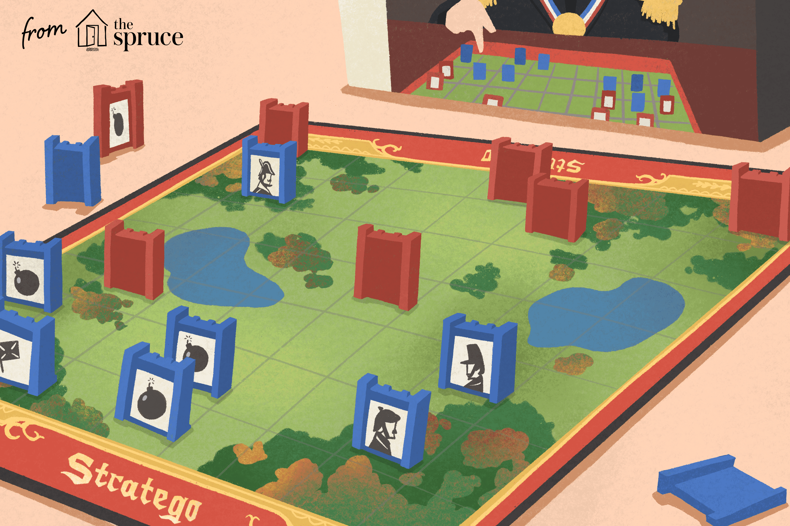
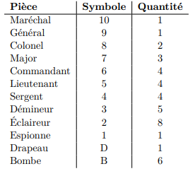
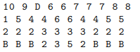

<h1>Bienvenue sur Stratego !</h1>

<h3>Projet développé par Oudahya Younes et El kaoui Mohamed </h3>

<h1 id="regle">REGLES DU JEU</h1> 

Une partie se déroule en 2 étapes : le choix d'un plateau fourni par défaut ou le choix du joueur fourni dans le fichier 
Ensuite vient le début de la partie ou le joueur Rouge commence et s'ensuit la bataille

Si vous souhaitez connaître les règles complète vous pouvez les consulter [ici](images/stratego-instructions-fr.pdf)
<h1>Comment lancer le jeu </h1>
<h2>MODE CONSOLE</h2>

Vous pouvez executer le main se trouvant dans le projet-tui via Qt-Creator

<h3>Comment modifier le fichier pour la mise en place des pièces ?

<h4>Le fichier doit suivre une structure qui sera imposé :</h4>

Chaque fichier est un fichier texte composé de quatre lignes

Chaque ligne du fichier est composée des symboles repris dans la table ci-dessous, séparés par des espaces

<h3>Le fichier final doit pouvoir ressembler à ça<h3>

<h3> Ou placer le fichier ?</h3>

Si vous souhaitez placer les fichiers contenant la mise en place de votre jeu,  vous devez les placer dans le dossier ressourcesGames se trouvant dans le projet

<h2>MODE GRAPHIQUE </h2>

Executer le main se trouvant dans le projet-gui 

<h3>- Concernant le déroulement du jeu</h3>

Pour lancer la partie il suffit d'appuyer sur <b>play</b>

Après avoir appuyer sur <b>play</b> , chaque joueur place ses pièces et lorsqu'il n'ya plus de pièce à placer il faut appuyer sur <b>endPlacement</b>

Il est possible d'abandonner en plein milieu de la partie avec <b>surrender</b>

Si une envie vous vient de quitter sachez qu'un <b>quit</b> est disponible

<h1>Structure du dossier</h1>
Stratego-project 
    |---<b>project-dummy</b>  
//Dossier concernant les tests//

    |---<b>project-model</b>  
//Dossier concernant le model du jeu//

    |---<b>project-tui</b>  
//Dossier concernant l'affichage console du jeu//

    |---<b>ressourcesGames</b>  
//Dossier concernant les fichiers pour le placement des pieces//

    |---<b>project-gui</b>  
//Dossier concernant l'affichage graphique du jeu

<h1>Documentation du jeu</h1>
<h4>Vous pouvez consulter la documentation du jeu [ici](Stratego-project/dev4-stratego-pha-07-project/doc/html/index.html)</h4>

               
              

